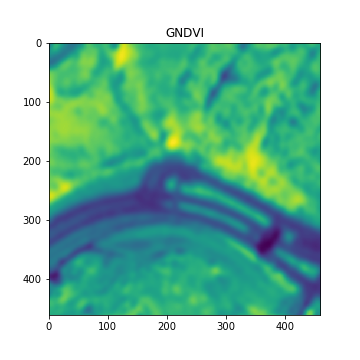
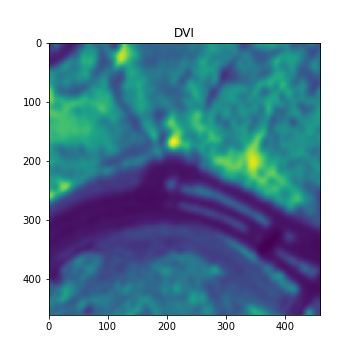

<b>Hello world! This repository is about two applications in remote sensing: GNDVI and DVI.</b>

<h3>GNDVI: Green Normalized Difference Index</h3>
<b>The Green Normalized Difference Vegetation Index (GNDVI) is a vegetation index for estimating photo synthetic activity and is a commonly used vegetation index to determine water and nitrogen uptake into the plant canopy.</b>

Example output:

<h3>VIN: Simple Ratio NIR/RED Difference Vegetation Index, Vegetation Index Number</h3>
<b>The Green Normalized Difference Vegetation Index (GNDVI) is a vegetation index for estimating photo synthetic activity and is a commonly used vegetation index to determine water and nitrogen uptake into the plant canopy.</b>

Example output:

The list of Python packages used in this project:
<ul>
  <li><a href=https://numpy.org/>NumPy</a>
  <li><a href=https://scikit-image.org/>scikit-image</a>
  <li><a href=https://matplotlib.org/>matplotlib</a>
